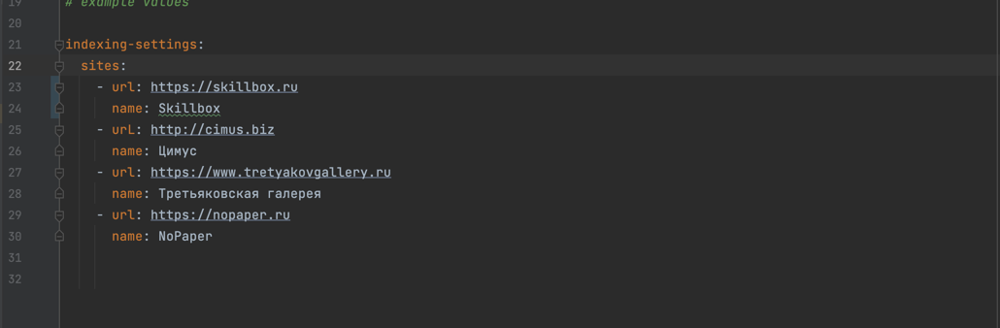
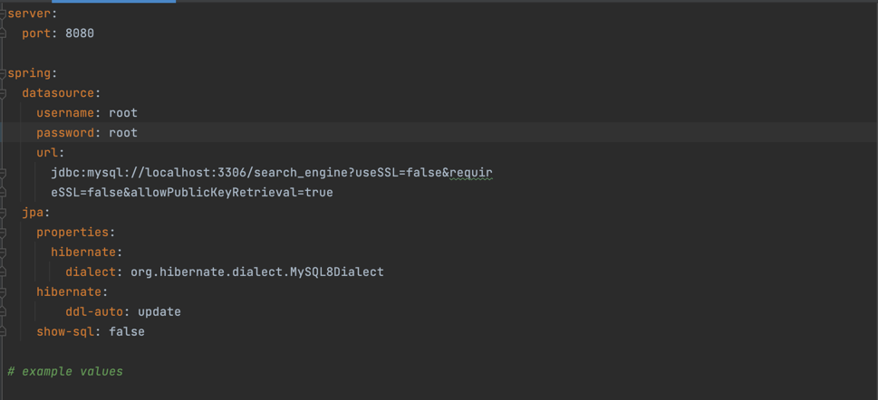
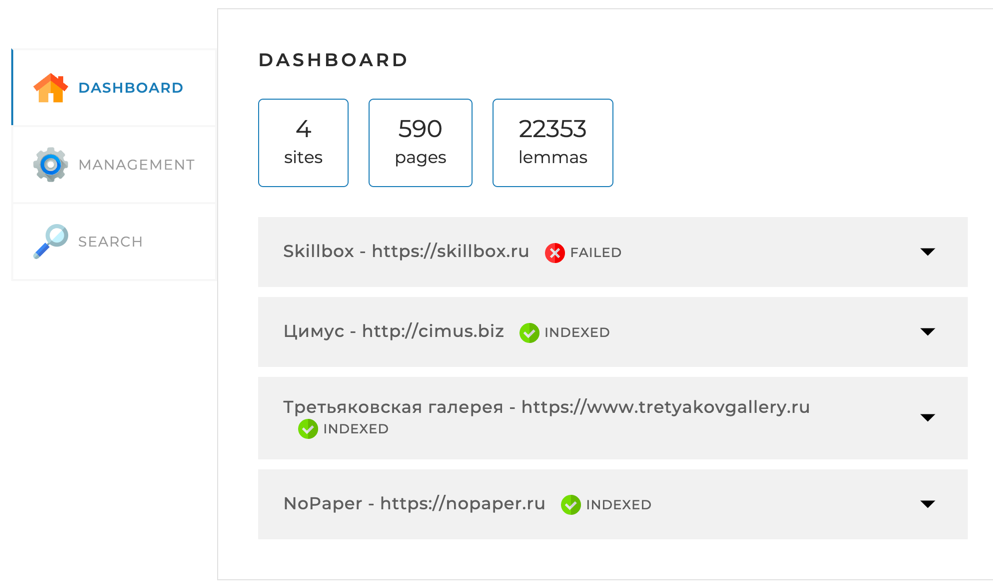
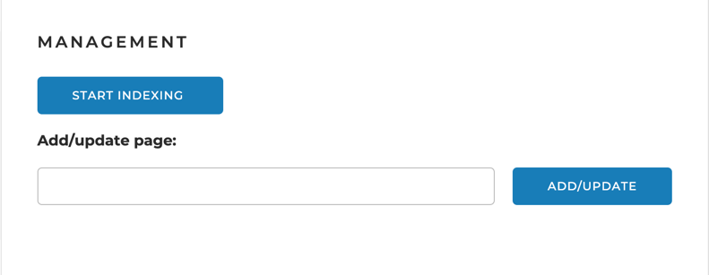
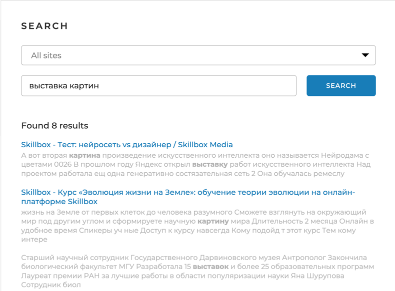

                                            Search engine - Поисковый движок

                                    Поисковый движок является программным компонентом,
                    который позволяет пользователям быстро и эффективно находить информацию на сайте.
    Поисковый движок по сайтам, ссылки и названия сайтов указанны в конфигурации проекта application.yaml.
                                            Скрин файла конфигурации:

                                    Описание файла и параметров: server: port: 8080

                                Для индексации сайтов, укажите url - сайта, name, id;

        В проекте используется база данных MySQL. Чтобы запустить индексацию, потребуется создать схему 
        с именем : search_engine. В файле конфигурации прописана ссылка и порт для подключению к базе данных. 
                                 Необходимо указать Ваши данные для авторизации.

                                 Ссылка для подключения к БД выглядит следующим образом:

                                        Основные характеристики поискового движка:

        Алгоритм поиска:
            Реализован собственный алгоритм поиска, который обеспечивает точность и релевантность результатов.
            Алгоритм может быть доработан и улучшен в будущем.
        База данных: 
            Поисковый движок работает с локально установленной базой данных MySQL,
            где хранится индексированная информация о новостях и статьях.
        Веб-интерфейс: 
            Поисковый движок предоставляет простой и интуитивно понятный веб-интерфейс для взаимодействия с 
        пользователями. На веб-интерфейсе пользователи могут вводить поисковые запросы и просматривать результаты.

                                                 Вкладка DASHBOARD:
                 Отображается статистика по всем сайтам указанных в конфигурационном файле, в том числе:
                    1)Кол-во найденных лемм;
                    2)Кол-во найденных страниц;
                    3)Время когда запускалась индексация;
                    4)Последння ошибка при индексации.

                                                Вкладка MANAGEMENT:
                Кнопка запуска индексации страниц Start Indexing,а так же возможность проиндексировать 
                            отдельную страницу сайта, указанного в конфигурационном файле.

                                                Вкладка Search:
                Есть возможность искать как по отдельному сайта, так и по всем сразу.В данной вкладке есть поле, 
            в которое вы можете написать свой запрос, а программа найдет все страницы с интересующей вас информацией.

